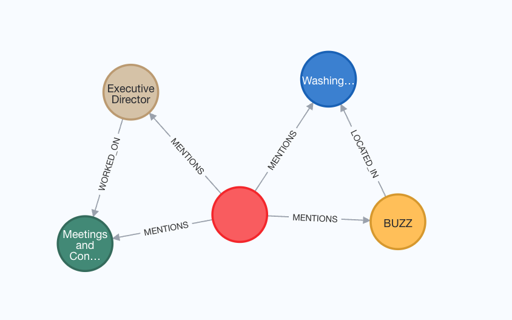
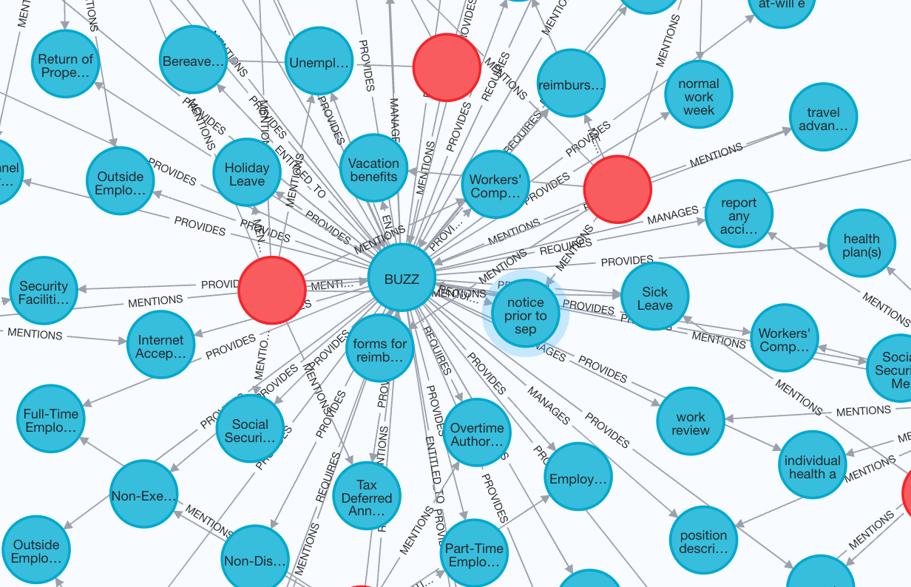
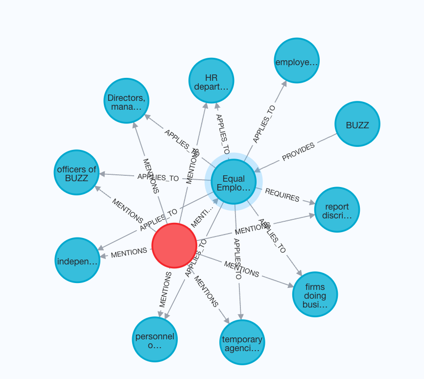

<a href="https://colab.research.google.com/github/ag2ai/ag2/blob/main/notebook/agentchat_graph_rag_neo4j.ipynb" class="colab-badge" target="_blank"></a>
<a href="https://github.com/ag2ai/ag2/blob/main/notebook/agentchat_graph_rag_neo4j.ipynb" class="github-badge" target="_blank"></a>


AG2 provides GraphRAG integration through agent capabilities. This is an
example utilising the integration of Neo4j’s property graph database
with LlamaIndex’s graph query engine.

````mdx-code-block
:::info Requirements
To install the LlamaIndex, Neo4j, and document processing dependencies, install with the 'neo4j' extra:

```bash
pip install ag2[neo4j]
```


## Set Configuration and OpenAI API Key

By default, in order to use LlamaIndex with Neo4j you need to have an OpenAI key in your environment variable `OPENAI_API_KEY`.

You can utilise an OAI_CONFIG_LIST file and extract the OpenAI API key and put it in the environment, as will be shown in the following cell.

Alternatively, you can load the environment variable yourself.

````{=mdx}
:::tip
Learn more about configuring LLMs for agents [here](/docs/topics/llm_configuration).
:::
````

```python
import os

import autogen

config_list = autogen.config_list_from_json(env_or_file="OAI_CONFIG_LIST")

# Put the OpenAI API key into the environment
os.environ["OPENAI_API_KEY"] = config_list[0]["api_key"]
```


```python
# This is needed to allow nested asyncio calls for Neo4j in Jupyter
import nest_asyncio

nest_asyncio.apply()
```

## Key Information: Using Neo4j with LLM Models 🚀 

> **Important**  
> - **Default Models**: - **Question Answering**: OpenAI’s `GPT-4o` with
> `temperature=0.0`. - **Embedding**: OpenAI’s `text-embedding-3-small`.
>
> -   **Customization**: You can change these defaults by setting the
>     following parameters on the `Neo4jGraphQueryEngine`:
>     -   `llm`: Specify a LLM instance with a llm you like.
>     -   `embedding`: Specify a BaseEmbedding instance with a embedding
>         model.
> -   **Reference**
>     -   https://docs.llamaindex.ai/en/stable/module_guides/models/llms/
>     -   https://docs.llamaindex.ai/en/stable/examples/property_graph/graph_store/

## Create a Knowledge Graph with Your Own Data

**Note:** You need to have a Neo4j database running. If you are running
one in a Docker container, please ensure your Docker network is setup to
allow access to it.

In this example, the Neo4j endpoint is set to host=“bolt://172.17.0.3”
and port=7687, please adjust accordingly. For how to spin up a Neo4j
with Docker, you can refer to
[this](https://docs.llamaindex.ai/en/stable/examples/property_graph/property_graph_neo4j/#:~:text=stores%2Dneo4j-,Docker%20Setup,%C2%B6,-To%20launch%20Neo4j)

We initialise the database with a Word document, creating the Property
graph in Neo4j.

```python
# IMPORTS
from llama_index.embeddings.openai import OpenAIEmbedding
from llama_index.llms.openai import OpenAI

from autogen import ConversableAgent, UserProxyAgent
from autogen.agentchat.contrib.graph_rag.neo4j_graph_query_engine import Neo4jGraphQueryEngine
```

### A Simple Example

In this example, the graph schema is auto-generated. This allows you to
load data without specifying the specific types of entities and
relationships that will make up the database. However, it will only use
some default simple relationships including “WORKED_ON”, “MENTIONS”,
“LOCATED_IN”

LlamaIndex supports a lot of extensions including docx, text, pdf, csv,
etc. Find more details in Neo4jGraphQueryEngine. You may need to install
dependencies for each extension. In this example, we need
`pip install docx2txt`

We start by creating a Neo4j property graph (knowledge graph) with a
sample employee handbook of a finctional company called BUZZ

```python
# load documents
from autogen.agentchat.contrib.graph_rag.document import Document, DocumentType

input_path = "../test/agentchat/contrib/graph_rag/BUZZ_Employee_Handbook.docx"
input_documents = [Document(doctype=DocumentType.TEXT, path_or_url=input_path)]
```

An example property graph:

<figure>

<figcaption aria-hidden="true">neo4j_property_graph_1.png</figcaption>
</figure>

### Schema

Define our custom entities, relations and schema

```python
from typing import Literal

# best practice to use upper-case
entities = Literal["EMPLOYEE", "EMPLOYER", "POLICY", "BENEFIT", "POSITION", "DEPARTMENT", "CONTRACT", "RESPONSIBILITY"]
relations = Literal[
    "FOLLOWS",
    "PROVIDES",
    "APPLIES_TO",
    "DEFINED_AS",
    "ASSIGNED_TO",
    "PART_OF",
    "MANAGES",
    "REQUIRES",
    "ENTITLED_TO",
    "REPORTS_TO",
]

# define which entities can have which relations
validation_schema = {
    "EMPLOYEE": ["FOLLOWS", "APPLIES_TO", "ASSIGNED_TO", "ENTITLED_TO", "REPORTS_TO"],
    "EMPLOYER": ["PROVIDES", "DEFINED_AS", "MANAGES", "REQUIRES"],
    "POLICY": ["APPLIES_TO", "DEFINED_AS", "REQUIRES"],
    "BENEFIT": ["PROVIDES", "ENTITLED_TO"],
    "POSITION": ["DEFINED_AS", "PART_OF", "ASSIGNED_TO"],
    "DEPARTMENT": ["PART_OF", "MANAGES", "REQUIRES"],
    "CONTRACT": ["PROVIDES", "REQUIRES", "APPLIES_TO"],
    "RESPONSIBILITY": ["ASSIGNED_TO", "REQUIRES", "DEFINED_AS"],
}
```

### Create the query engine and load the document

```python
# Create Neo4jGraphQueryEngine
query_engine = Neo4jGraphQueryEngine(
    username="neo4j",  # Change these as needed
    password="neo4jneo4j",
    host="bolt://192.168.0.115",
    port=7687,
    database="neo4j",
    llm=OpenAI(model="gpt-4o", temperature=0.0),
    embedding=OpenAIEmbedding(model_name="text-embedding-3-small"),
    entities=entities,  # possible entities
    relations=relations,  # possible relations
    validation_schema=validation_schema,  # schema to validate the extracted triplets
    strict=True,  # enforce the extracted triplets to be in the schema
)

# Ingest data and initialize the database
query_engine.init_db(input_doc=input_documents)
```

``` text
/home/mark/miniconda3/envs/ag2neo4j/lib/python3.13/site-packages/tqdm/auto.py:21: TqdmWarning: IProgress not found. Please update jupyter and ipywidgets. See https://ipywidgets.readthedocs.io/en/stable/user_install.html
  from .autonotebook import tqdm as notebook_tqdm
Parsing nodes: 100%|██████████| 1/1 [00:00<00:00, 321.70it/s]
Extracting paths from text with schema: 100%|██████████| 3/3 [00:29<00:00,  9.92s/it]
Generating embeddings: 100%|██████████| 1/1 [00:00<00:00,  1.41it/s]
Generating embeddings: 100%|██████████| 1/1 [00:01<00:00,  1.19s/it]
```

The Property graph screenshot is shown below:

<figure>

<figcaption aria-hidden="true">neo4j_property_graph_2.png</figcaption>
</figure>

### Create Neo4j-based RAG agents

With the schema defined and data loaded, we can now create a capable
agent!

```python
from autogen.agentchat.contrib.graph_rag.neo4j_graph_rag_capability import Neo4jGraphCapability

# Create a ConversableAgent (no LLM configuration)
graph_rag_agent = ConversableAgent(
    name="rag_agent",
    human_input_mode="NEVER",
)

# Associate the capability with the agent
graph_rag_capability = Neo4jGraphCapability(query_engine)
graph_rag_capability.add_to_agent(graph_rag_agent)

# Create a user proxy agent to converse with our RAG agent
user_proxy = UserProxyAgent(name="user_proxy", human_input_mode="ALWAYS", code_execution_config=False)

user_proxy.initiate_chat(graph_rag_agent, message="Which company is the employer?")
```

``` text
user_proxy (to rag_agent):

Which company is the employer?

--------------------------------------------------------------------------------
rag_agent (to user_proxy):

BUZZ Co.

--------------------------------------------------------------------------------
user_proxy (to rag_agent):

Tell me about sick leave

--------------------------------------------------------------------------------
rag_agent (to user_proxy):

Employees at BUZZ Co. are entitled to one day of sick leave per month for full-time employees, which is prorated for part-time employees, with a maximum accumulation of up to 30 days.

--------------------------------------------------------------------------------
user_proxy (to rag_agent):

And vacation?

--------------------------------------------------------------------------------
rag_agent (to user_proxy):

Full-time employees at BUZZ Co. earn 10 days of vacation after the first year, 15 days after the third year, and 20 days after the fourth year. Part-time employees' vacation days are prorated based on their hours worked.

--------------------------------------------------------------------------------
```

``` text
ChatResult(chat_id=None, chat_history=[{'content': 'Which company is the employer?', 'role': 'assistant', 'name': 'user_proxy'}, {'content': 'BUZZ Co.', 'role': 'user', 'name': 'rag_agent'}, {'content': 'Tell me about sick leave', 'role': 'assistant', 'name': 'user_proxy'}, {'content': 'Employees at BUZZ Co. are entitled to one day of sick leave per month for full-time employees, which is prorated for part-time employees, with a maximum accumulation of up to 30 days.', 'role': 'user', 'name': 'rag_agent'}, {'content': 'And vacation?', 'role': 'assistant', 'name': 'user_proxy'}, {'content': "Full-time employees at BUZZ Co. earn 10 days of vacation after the first year, 15 days after the third year, and 20 days after the fourth year. Part-time employees' vacation days are prorated based on their hours worked.", 'role': 'user', 'name': 'rag_agent'}], summary="Full-time employees at BUZZ Co. earn 10 days of vacation after the first year, 15 days after the third year, and 20 days after the fourth year. Part-time employees' vacation days are prorated based on their hours worked.", cost={'usage_including_cached_inference': {'total_cost': 0}, 'usage_excluding_cached_inference': {'total_cost': 0}}, human_input=['Tell me about sick leave', 'And vacation?', 'exit'])
```

### Incrementally add new documents to the existing knoweldge graph!

```python
input_path = "../test/agentchat/contrib/graph_rag/BUZZ_Equal-Employment-Opportunity-Policy-Detailed.docx"
input_documents = [Document(doctype=DocumentType.TEXT, path_or_url=input_path)]

_ = query_engine.add_records(input_documents)
```

``` text
Parsing nodes: 100%|██████████| 1/1 [00:00<00:00, 545.99it/s]
Extracting paths from text with schema: 100%|██████████| 1/1 [00:30<00:00, 30.24s/it]
Generating embeddings: 100%|██████████| 1/1 [00:00<00:00,  2.61it/s]
Generating embeddings: 100%|██████████| 1/1 [00:01<00:00,  1.20s/it]
```

Checking the property graph, we’ll find a new policy (entity) called
Equal Employment Opportunity Policy is added

<figure>

<figcaption aria-hidden="true">neo4j_property_graph_3.png</figcaption>
</figure>

### Now let’s create a new GraphRag agent and some questions related to both documents

```python
from autogen.agentchat.contrib.graph_rag.neo4j_graph_rag_capability import Neo4jGraphCapability

# Ask questions about both documents
user_proxy.initiate_chat(graph_rag_agent, message="What is Equal Employment Opportunity Policy at BUZZ?")
```

``` text
user_proxy (to rag_agent):

What is Equal Employment Opportunity Policy at BUZZ?

--------------------------------------------------------------------------------
rag_agent (to user_proxy):

The Equal Employment Opportunity Policy at BUZZ Co. ensures non-discrimination and equal employment opportunities for all employees and applicants. It prohibits discrimination or harassment based on various factors and covers aspects such as recruitment, promotion, training, working conditions, wages, and benefits. The policy is disseminated by BUZZ Co. officers, implemented by directors, managers, and supervisors, and enforced by the Human Resources department to ensure company-wide compliance with anti-discrimination laws and regulations.

--------------------------------------------------------------------------------
user_proxy (to rag_agent):

What's the scope of the Equal Employment Opportunity and Anti-Discrimination Policy?

--------------------------------------------------------------------------------
rag_agent (to user_proxy):

The scope of the Equal Employment Opportunity and Anti-Discrimination Policy includes all aspects of the employment relationship at BUZZ Co., such as recruitment, employment, promotion, transfer, training, working conditions, wages and salary administration, and employee benefits. This policy also extends to the selection and treatment of independent contractors, temporary agency personnel working on BUZZ Co. premises, and any other individuals or firms conducting business for or with BUZZ Co.

--------------------------------------------------------------------------------
user_proxy (to rag_agent):

Is Promotion part of the scope of the Equal Employment Opportunity and Anti-Discrimination Policy?

--------------------------------------------------------------------------------
rag_agent (to user_proxy):

Yes.

--------------------------------------------------------------------------------
```

``` text
ChatResult(chat_id=None, chat_history=[{'content': 'What is Equal Employment Opportunity Policy at BUZZ?', 'role': 'assistant', 'name': 'user_proxy'}, {'content': 'The Equal Employment Opportunity Policy at BUZZ Co. ensures non-discrimination and equal employment opportunities for all employees and applicants. It prohibits discrimination or harassment based on various factors and covers aspects such as recruitment, promotion, training, working conditions, wages, and benefits. The policy is disseminated by BUZZ Co. officers, implemented by directors, managers, and supervisors, and enforced by the Human Resources department to ensure company-wide compliance with anti-discrimination laws and regulations.', 'role': 'user', 'name': 'rag_agent'}, {'content': "What's the scope of the Equal Employment Opportunity and Anti-Discrimination Policy?", 'role': 'assistant', 'name': 'user_proxy'}, {'content': 'The scope of the Equal Employment Opportunity and Anti-Discrimination Policy includes all aspects of the employment relationship at BUZZ Co., such as recruitment, employment, promotion, transfer, training, working conditions, wages and salary administration, and employee benefits. This policy also extends to the selection and treatment of independent contractors, temporary agency personnel working on BUZZ Co. premises, and any other individuals or firms conducting business for or with BUZZ Co.', 'role': 'user', 'name': 'rag_agent'}, {'content': 'Is Promotion part of the scope of the Equal Employment Opportunity and Anti-Discrimination Policy?', 'role': 'assistant', 'name': 'user_proxy'}, {'content': 'Yes.', 'role': 'user', 'name': 'rag_agent'}], summary='Yes.', cost={'usage_including_cached_inference': {'total_cost': 0}, 'usage_excluding_cached_inference': {'total_cost': 0}}, human_input=["What's the scope of the Equal Employment Opportunity and Anti-Discrimination Policy?", 'Is Promotion part of the scope of the Equal Employment Opportunity and Anti-Discrimination Policy?', 'exit'])
```
